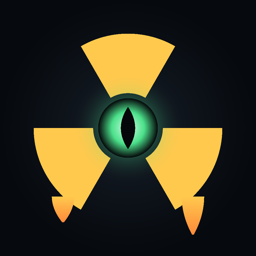

<p align="center">
  
</p>

<h1 align="center">MELTDOWN</h1>

<p align="center">
  <strong>A nuclear reactor control-room simulator that is haunted.</strong><br>
  Run a pressurised water reactor through the night shift. Something else is in the building.
</p>

<p align="center">
  <a href="https://jasraajdevz.github.io/meltdown/"><strong>▶ Play in your browser</strong></a>
</p>

<p align="center">
  
  
  
  
</p>

---

## What it is

You are the night-shift operator. The plant is real: point kinetics, Doppler
feedback, a moderator temperature coefficient, xenon poisoning, fuel burnup,
thermal inertia and a reactor protection system that trips before the core is
hurt. You take it from a handover, follow the grid dispatcher through the
overnight trough and into the dawn peak, and you hand it over at 06:00.

Malfunctions arrive on their own. So does something else.

**A thousand nights.** Every night is derived from its number — ten difficulty
tiers, sixteen named conditions with real mechanical weight, a scripted load
profile, and a length that ends the watch itself. Night 412 is the same night
whether you reach it today or after a reinstall.

**Fifteen malfunctions and presences.** Each has an effect on the plant, a tell
you can learn, and an answer you can hold. A pump trip you ride out. A flux
channel that lies, where tripping the reactor *is* the failure. Something that
masks the annunciator, so silencing it costs you the horn entirely. Something
that removes the trip setpoints keeping you alive — the only one that helps
you, which is what makes it the worst.

**A reason to be there.** The operator before you left his logbook in the desk.
Twenty-two pages. He worked out what it wants, and what it takes to make it
stop, and he got to four hundred and six nights.

> *A licensed unit needs an operator of record with a thousand logged watches
> to petition for decommissioning. Resigning sends the next one.*

## Build it

```bash
flutter pub get
flutter run                 # or: flutter run -d chrome
flutter test --platform chrome
flutter build web --release --pwa-strategy=none
```

There are no pub dependencies. Platform differences (storage, audio,
text-to-speech) are handled by conditional imports, not packages.

## Release checks

```bash
python3 tool/release_audit.py     # 29 store-readiness assertions
python3 tool/make_mark.py         # re-render the icon master
```

`release_audit.py` verifies bundle identity across platforms, portrait locks,
non-white launch screens, every icon slot and pixel size, web manifest and
meta, and that no signing material is tracked. `make_mark.py` renders the mark
from the same geometry as the in-app `LogoPainter`, so the icon and the app can
never drift apart.

## Layout

| | |
|---|---|
| `lib/main.dart` | the whole game — physics, nights, presences, every screen |
| `lib/storage_*.dart` | atomic save with a backup, per platform |
| `lib/audio_*.dart` | Web Audio synthesis; haptics on native |
| `test/night_test.dart` | nights 1–1000 do not repeat |
| `test/presence_test.dart` | every presence bites, can be answered, and lets go |
| `test/playtest_test.dart` | an instrumented night flown by a scripted operator |
| `test/layout_test.dart` | no overflow on five phone sizes |
| `test/storage_test.dart` | progress survives being killed mid-write |

## Status

Web is live and playable. iOS and Android are configured to ship — identity,
icons, launch screens and orientation — but **neither native binary has been
compiled**: the machine this was built on has no Android SDK and an incomplete
Xcode. Release signing is deliberately untouched.

Native audio is silent by design. `tone()` and `noise()` are no-ops off the
web, because synthesis there needs a plugin or a platform channel; every sound
has a haptic instead.

## Licence

All rights reserved.
